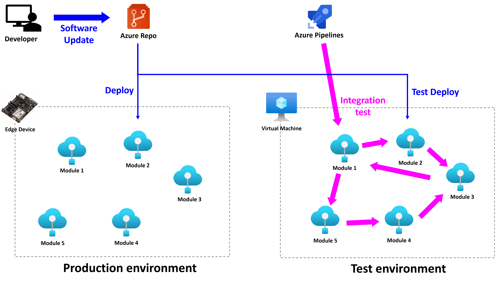
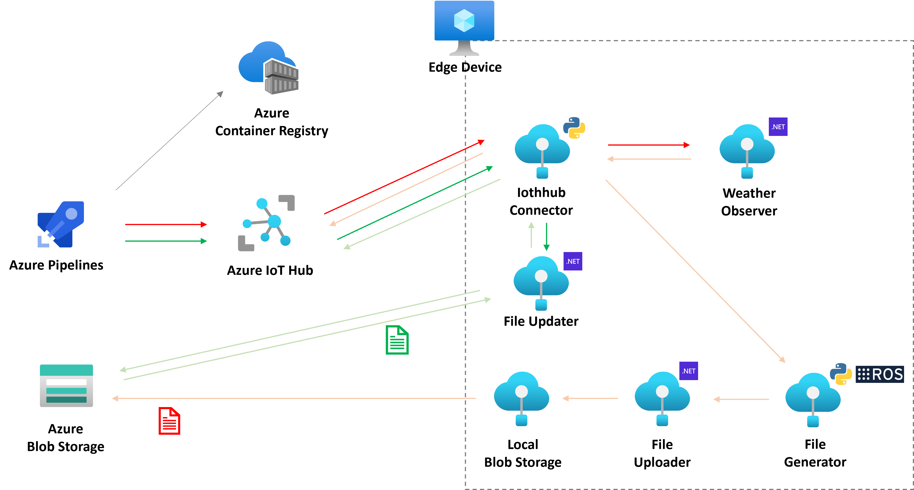
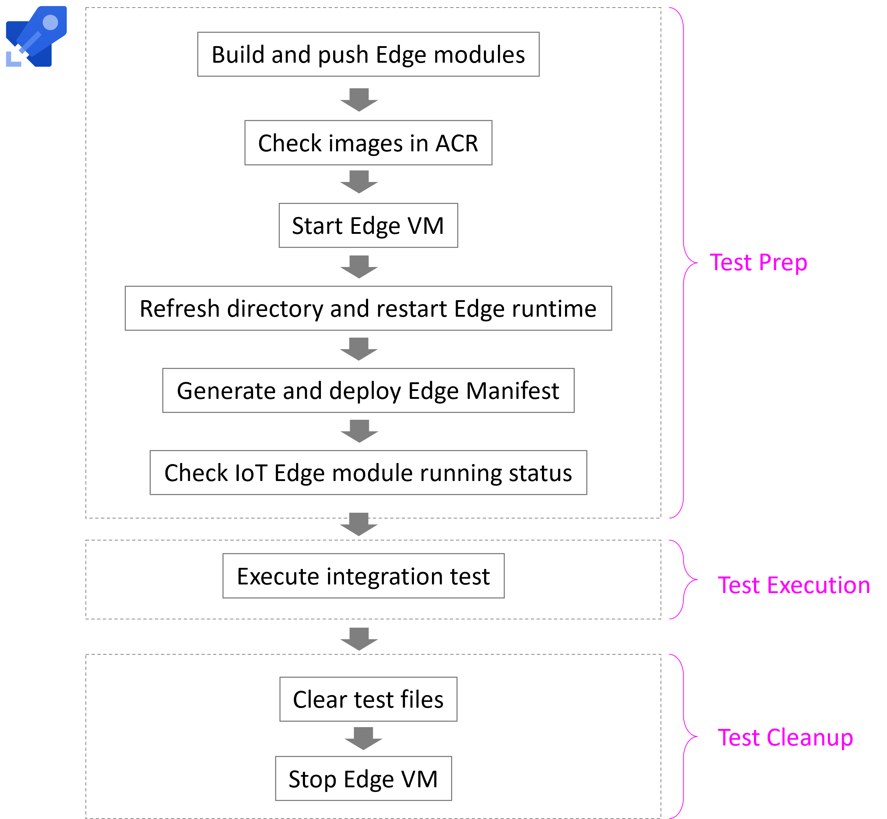

# Azure IoT Edge Integration Test template
This repository introduces a sample of how to create an integration test environment for [Azure IoT Edge](https://docs.microsoft.com/en-us/azure/iot-edge/about-iot-edge) modules. You can run the Infrastructure as Code (IaC) pipeline to deploy Azure resources required for the test and the integration test pipeline to set up a test environment and execute the test. Follow the instruction in [Getting-Started](./docs/getting-started.md) to deploy this template. Detailed module configurations are in [Module-Design](./docs/module-design.md).

## Reference

- [Azure IoT Edge Integration Test template - Part.1](https://dev.to/koheikawata/azure-iot-edge-integration-test-template-part1-3911)
- [Azure IoT Edge Integration Test template - Part.2](https://dev.to/koheikawata/azure-iot-edge-integration-test-template-part2-378l)
- [Azure IoT Edge Integration Test template - Part.3](https://dev.to/koheikawata/azure-iot-edge-integration-test-template-part3-5eld)

# Use case

When you have multiple Azure IoT Edge modules on an edge device and want to update codes of one of those modules, you can make sure the code quality by implementing linter and unit tests, but it is difficult to validate communications among modules. That is why executing integration tests every time you update the software. In this template, you can execute integration tests of Azure IoT Edge modules on Test Environment on Azure Virtual Machine. The test procedure is all automated by Azure Pipelines. [iac.yml](./pipelines/iac.yml) enables you to run the deployment of Azure resources for the integration tests and [integration-test.yml](./pipelines/integration-test.yml) to run the integration test preparation and execution.

**Azure services used**

- [Azure IoT Hub](https://docs.microsoft.com/en-us/azure/iot-hub/iot-concepts-and-iot-hub)
- [Azure Container Registry](https://docs.microsoft.com/en-us/azure/container-registry/container-registry-intro)
- [Azure Storage Account](https://docs.microsoft.com/en-us/azure/storage/common/storage-account-overview)
- [Azure Virtual Machine](https://docs.microsoft.com/en-us/azure/virtual-machines/linux/overview)
- [Azure Pipelines](https://docs.microsoft.com/en-us/azure/devops/pipelines/get-started/what-is-azure-pipelines)

# Architecture

**IoT Edge host machine**

In this test environment, Azure IoT Edge modules are running on a virtual machine with Ubuntu 20.04 operating system. Once you deploy a Virtual Machine, you need to install Azure IoT Edge runtime and set up other necessary tools and configurations. You will create an IoT Edge device on Azure IoT Hub, extract its device connection string, and set up the IoT Edge configuration. 

**IoT Edge modules**

This sample includes six IoT Edge sample modules.

- **IothubConnector**: Receive a direct method request from the IoT Hub, send a request to `WeatherObserver`, receive the weather data,  forward it to IoT Hub and `FileGenerator`, written in Python with Azure IoT Edge module client and ROS2. 
- **WeatherObserver**: Receive a request from `IothubConnector` and then return the weather report of a pointed city, written in C#.
- **FileGenerator**: Receive a request from `IothubConnector` and then generate the weather report file of a pointed city, written in Python with ROS2.
- **FileUploader**: Extract files generated by `FileGenerator` and upload them to `LocalBlobStorage`, written in C#.
- **FIleUpdater**: Receive a message from `IothubConnector` and download weather archive files from Azure Blob Storage, written in C#.
- **LocalBlobStorage**: [Azure Blob Storage on IoT Edge](https://docs.microsoft.com/en-us/azure/iot-edge/how-to-store-data-blob) is provided from `mcr.microsoft.com/azure-blob-storage:latest`.

**Test procedure**

Azure Pipelines agent takes each step below during the integration test pipeline.

- Test Prep
  - Build all Iot Edge modules and push those container images to Azure Container Registry.
  - Check if container images with pointed repository and tags exist.
  - Start a Virtual Machine and IoT Edge runtime.
  - Clean up old directories and files and create new ones and restart the IoT Edge runtime.
  - Generate a IoT Edge manifest and deploy it through the IoT Hub.
  - Check and make sure all IoT Edge module status is "running".
- Test Execution
  - Execute the integration tests.
- Test Cleanup
  - Clean up test files.
  - Stop the Virtual Machine.

